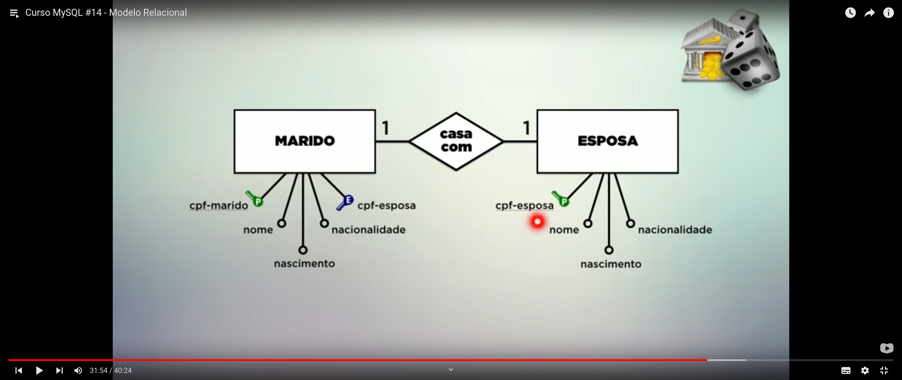
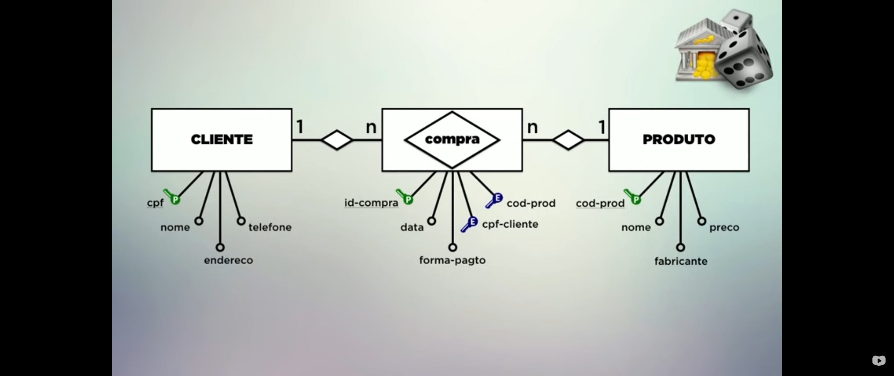
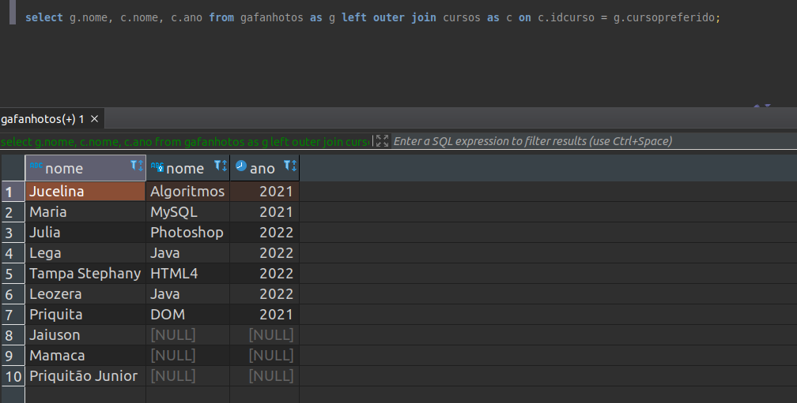

# Banco de dados
* Objetivo do banco de dados: Registrar instâncias seperadas com caracteristicas semelhantes
* *Banco*: Coleções de dados
    * *Tabelas*: Locais com os dados (conjunto de registros) que contém campos
    * Dados dentro da tabela chamam *REGISTROS*


# Tipos Primitivos
* *Numérico* (diferença está qtd de bytes vai utilizar para armazenar o dado, influência no tamanho do dado que vai guardar)
    * Inteiro
        * TinyInt (3 bytes)
        * SmallInt
        * Int (11 bytes)
        * MidiumInt
        * BigInt

    * Real 
        * Decimal
            * decimal(total_de_casas, numeros_apos_virgula)
                * decimal(5,2)
                        * ex: 102,32
        * Float
        * Double
        * Real 

    * Lógico (sim e não, false e true, 0 e 1)
        * Bit
        * Boolean

* *Data / Tempo*
    * Date (data)
    * DateTime (data, horas e informaçoes a mais)
    * TimeStamp (data, horas e informaçoes a mais)
    * Time (hora)
    * Year (ano)

* *Literal*
    * Caractere
        * Char (fixo)
            * Ocupa os espaços fixos
        * VarChar (variante)
            * Define um tamanho mas pode variar pra menos

    * Texto 
        * TinyText 
        * Text
        * MediuText
        * LongText

    * `Diferença entre caractere e texto -> texto: longos, caractere: +curto`

    * Binário (guardar qualquer coisa em binário -> Ex: Img)
        * TinyBlob
        * Blob
        * MediuBlob
        * LongBlob

    * Coleção (config valores permitidos)
        * Enum
            * Enum('M', 'F')
        * Set

* *Espaciais* (cadastro de algo volumetrico)
    * Geometry
    * Point
    * Polygon
    * MultiPolygon

# Geral
* Acessar no terminal
```sh
mysql -uroot -proot
```

```sql
show databases;
use databaseDesejada
show tables

```

* Mostrar estrutura da table
```sql
describe pessoas;
desc pessoas;
```

* Quando quiser salvar idade colocar data de nascimento, pq a idade muda mas a data não

* Chave primaria -> Valor único na tabela

* UNIQUE
    * Não permite repetir o valor (não é primary key)

* int UNSIGNED
    * Não permite sinal

* Registros ou tupla é a mesma coisa que linha

# Comandos

* Comando para criar database
```sql
create database nameDatabase character set utf8 collate utf8_unicode_ci;
```

* Comando criar table
```sql
CREATE TABLE IF NOT EXISTS nameTable (
    id int NOT NULL AUTO_INCREMENT,
    nome varchar(30) NOT NULL,
    nascimento date,
    sexo enum('M','F'),
    peso decimal(5,2),
    altura decimal(3,2),
    nacionalidade varchar(20) DEFAULT 'Brasil',
    PRIMARY KEY (id)
);
```

* Apagar uma Table
```sql
drop database cadastro;
```

* Inserir Dados em uma tabela
```sql
insert into tableDesejada (campo1, campo2, campo2...)
values ('value1', 'value2', 'value3'...)
```
    * Se a ordem dos campos a serem inseridos forem o mesmo, pode omitor os campo
        ex: 
```sql
-- table so com nome e cpf
insert into tableDesejada (nome, cpf)
values 
    ('Leo', '1324-51923-9'),
    ('Patrick', '3324-51923-9'),
    ('Creuza', '5324-51923-9'),

-- mesmo que
insert into tableDesejada values ('Leo', '1324-51923-9')
```

* *Alterar tabela*

* Adicionar coluna
```sql
ALTER TABLE nameTable
ADD COLUMN nameColumn varchar(10); 
```

* Remover coluna

```sql
ALTER TABLE nameTable
DROP COLUMN nameColumn;
```

* Escolher posiçao para add a coluna
```sql
ALTER TABLE pessoas ADD COLUMN nome_da_coluna_ser_add varchar(10) AFTER nome_da_coluna_de_referencia_para_inserir;
```

* Adicionar como primeiro campo
```sql
ALTER TABLE pessoas ADD COLUMN nome_da_coluna_ser_add int FIRST;
```

* Alterar estrutura de um campo
```sql
ALTER TABLE nome_table MODIFY COLUMN nome_da_coluna_ser_modificada varchar(30);
```

* Alterar NOME da coluna
```sql
ALTER TABLE nome_da_table CHANGE COLUMN nome_antigo_da_coluna nome_novo_da_coluna varchar(30) NOT NULL DEFAULT '';
```

* Renomear a table inteira
```sql
ALTER TABLE nome_antigo_table RENAME TO nome_novo_da_coluna;
```

* Adicionar chave primaria a uma column
```sql
ALTER TABLE nome_tabela ADD COLUMN id int FIST;

ALTER TABLE nome_table ADD PRIMARY KEY (id);
```

* Alterar linha (registro ou tupla)
```sql
UPDATE nome_da_tabela 
SET campo_da_tabela_que_sofrera_mudanca1 = 'novoValor1', 
    campo_da_tabela_que_sofrera_mudanca2 = 'novoValor2' where condicao;
```

    * Limitar quantas linhas vão ser afetadas
```sql
UPDATE cursos set nome = 'php' where id = '1' LIMIT 1
```

* Remover linhas
```sql
DELETE FROM nome_da_table WHERE condicao;
-- limitar quantidade
DELETE FROM nome_da_table WHERE condicao LIMIT 3;
```


* Apagar todos os registros / dados / linha de uma tabela
```sql
TRUNCATE TABLE nome_da_table_que_vai_remover_as_linhas;

-- mesma coisa
TRUNCATE nome_da_table_que_vai_remover_as_linhas;
```

# SELECT
* Escolher a ordem da seleção
```sql
SELECT * FROM nome_da_table ORDER BY nome_campo_que_vai_seguir_a_ordem;

-- MESMA COISA ACIMA
SELECT * FROM nome_da_table ORDER BY nome_campo_que_vai_seguir_a_ordem ASC;


-- COMEÇA COM MAIOR(NUM) OU ULTIMA LETRA(TEXT)
SELECT * FROM nome_da_table ORDER BY nome_campo_que_vai_seguir_a_ordem DESC;

-- mais de um campo
SELECT ano, nome, cpf FROM nome_da_table ORDER BY id, nome
```

* Selecionar com condição
```sql
SELECT * FROM nome_da_table WHERE condicao ORDER BY campo_que_vai_dar_base_p_ordem;

SELECT * FROM nome_da_table WHERE condicao1 AND condicao2 ORDER BY campo_que_vai_dar_base_p_ordem;

SELECT * FROM nome_da_table WHERE condicao1 OR condicao2 ORDER BY campo_que_vai_dar_base_p_ordem;

```

* Selecionar entre, valores especificos
```sql
-- entre
SELECT nome, ano FROM nome_da_table WHERE ano BETWEEN 2014 AND 2016;

-- valores especificos
SELECT ano, nome FROM cursos where ano IN ('2022', '2021');
```

* Like
```sql
SELECT * FROM nome_da_table WHERE nome like 'a%';
SELECT * FROM nome_da_table WHERE nome like '%a';

-- ACHAR EM QUALQUER LUGAR
SELECT * FROM nome_da_table WHERE nome like '%a%';

-- NÃO PEGA OS QEU COMEÇA COM 'A'
SELECT * FROM nome_da_table WHERE nome NOT like 'a%';

-- PEGA OS QUE COMEÇAM COM 'PH' E TERMINAL COM 'P'
    -- EX: PHP, PHOTOSHOP

SELECT * FROM cursos WHERE nome LIKE 'PH%P';

-- PARA OBRIGAR QUE TENHA UM CARACTER ANTES OU DPS USAR "_"
    --  No final tem algo dps do p
    -- ex: php4
SELECT * FROM nome_da_table WHERE nome like 'php%p_';
    -- No começo tem algo antes do p e termina com p
select * from cursos where nome like '%_p';

```

* Distinguindo
    * Não permite selecionar repetição, pega so um
    * Ex: Tabela com muitos usuários de diferentes paises onde muitos paises se repetem varias vezes. Usando DISTINCT ele não deixa repetir o pais na busca e lista os paises de onde os users moram
    ```sql
    SELECT DISTINCT nacionalidade from tabela_que_quer_selecionar ORDER BY nacionalidade;
    ```

* Funções de Agregação
    * COUNT - Selecionar ou totalizar alguma coisa
    ```sql
    -- Lista quantos nomes tem na tabela (se a table for muito grande pode levar tempo pra chegar no ultimo)
    select count(nome) from cursos;

    -- Conta as cargas maiores que 40
    select count(*) from cursos where carga > 40;
    ```

    * MAX(campo) - pega o valor max de um campo
    ```sql
    select max(carga) from cursos;
    select max(totaulas) from cursos where ano = '2021';
    ```

    * MIN(campo) - pega o valor min de um campo
    ```sql
    select min(totaulas) from cursos where ano = '2021';
    ```

    * SUM(campo) - somar
    ```sql
    select sum(totaulas) from cursos where ano = '2016'
    ```

    * AVG(campo) - Tirar a média
        * Soma tudo e divide pelo número de items
    ```sql
    select AVG(totaulas) from cursos where;
    ```
# Agrupamento
* O DISTINCT so distingui, se precisar contar quantas vezes aparecer precisa agrupar
```sql
select totaulas, count(*) from cursos GROUP BY totaulas;

-- mostrar se for maior que um valor
-- HAVING É SEMELHANTE AO WHERE DO SELECT
-- NO HAVING SO PODE USAR O CAMPO USADO NO GROUP BY
select carga, COUNT(nome) from cursos where totaulas = '20' group by carga HAVING count(nome) > 3;

SELECT ano, count(*) from cursos 
WHERE totaulas > 30
GROUP BY ano
HAVING ano > 2013
ORDER BY count(*) desc;
```

* Agrupando SELECT
```sql
-- vai mostrar sempre se for maior que a média de carga*
select carga, count(carga) from cursos 
where ano > 2015 
group by carga
having carga > (select avg(carga) from cursos);
```


# Exercício
1. 
```sql
-- 1) Uma lista com o nome de todos os gafanhotos Mulheres.

select nome from gafanhotos where sexo="f";

-- 2) Uma lista com os dados de todos aqueles que nasceram entre 1/Jan/2000 e 31/Dez/2015.

select * from gafanhotos where nascimento between '2000-01-01' and '2015-12-31';

-- 3) Uma lista com o nome de todos os homens que trabalham como programadores.
select nome from gafanhotos where prof = 'programador';

-- 4) Uma lista com os dados de todas as mulheres que nasceram no Brasil e que têm seu nome iniciando com a letra J.
select * from gafanhotos where nacionalidade = 'Brasil' and nome like 'j%';

-- 5) Uma lista com o nome e nacionalidade de todos os homens que têm Silva no nome, não nasceram no Brasil e pesam menos de 100 Kg.
select nome, nacionalidade from gafanhotos where sexo = 'M' and nacionalidade != 'Brasil' and peso < '100';

-- 6) Qual é a maior altura entre gafanhotos Homens que moram no Brasil?
select max(altura) from gafanhotos where nacionalidade = 'Brasil';

-- 7) Qual é a média de peso dos gafanhotos cadastrados?
select avg(peso) from gafanhotos;

-- 8) Qual é o menor peso entre os gafanhotos Mulheres que nasceram fora do Brasil e entre 01/Jan/1990 e 31/Dez/2000?
select min(peso) from gafanhotos where sexo = 'F' and nacionalidade <> 'brasil' and nascimento BETWEEN '1990-01-01' and '2000-12-31';
             

-- 9) Quantas gafanhotos Mulheres tem mais de 1.90cm de altura?
select * from gafanhotos where sexo = 'F' and altura > '1.90';
```

2. 
```sql
-- 1- Uma lista com as profissoes dos gafanhotos e seus respectivos quantitativos.

select prof, count(*) from gafanhotos group by prof order by count(*);

-- 2- Quantos gafanhotos homens e mulheres nasceram após 01/jan/2005

select sexo, count(sexo) from gafanhotos where nascimento > '2005-01-01' group by sexo;


-- 3- Lista com gafanhotos que nasceram fora do BRASIL, mostrando o país de origem e o total de pessoas nascidas lá. Só nos interessam os países que tiveram mais de 3 gafanhotos com essa nacionalidade.
select nacionalidade, count(*) from gafanhotos where nacionalidade != 'Brasil' group by nacionalidade having count(*) > 3;

-- 4- Uma lista agrupada pela altura dos gafanhotos, mostrando quantas pessoas pesam mais de 100kg e que estao acima da media da altura de todos os gafanhotos

select altura, count(*) from gafanhotos 
where peso > 100 
group by altura 
having altura > (select avg(altura) from gafanhotos);

```

# Banco Relacional
* Entidade
    * Container onde dentro tem dados (atributos)
        * Esses conjuntos de atributos vão identificar tuplas
        * Algum desses atributos serve pra identificar a tupla (primary key)
    * Toda entidade contém uma coleção de atributos

* Duas ou mais entidade podem relacionar entre si

* DER
    * Diagrama Entidade - Relacionamento


* Cardinalidade
    * Simples ou múltipla
    * Relacionamento *muitos para muitos* ou n para n
        Ex:
        * Uma pessoa pode assitir vários cursos
        * Cada um dos cursos pode ser assistido por N gafanhotos

    * Relacionamento *um para um*
        * So pode ter um Relacionamento
        Ex: 
        * Um marido so pode ter uma esposa e uma esposa so pode ter um marido

    * Relacionamento de *um para muitos*
        * Ex:
            * Cada funcionário pode ter N dependentes
            * Mas cada dependente so pode ter um funcionário

* Chave estrangeira
    * Relação entre entidades através da troca de chaves
    * É uma chave primária de algum lugar que veio de algum lugar

    * No relaciomento *um para um*
        * Analisar se pode juntar os dados em uma única tabela
        * Tem uma entidade dominante
        * Os nomes dos campo da chave estrangeira não precisa ser o mesmo do nome da tabela original, mas ter os mesmos tipo
    

    * No relacionamento *um para muitos*
        * Regra:
            * Pega a chave estrageira do lado um e joga para o lado muitos como chave estrangeira (ter os mesmo tipos no campo)

        * Ex: 
            * Um funcionário pode ter n dependentes, mas um depedente pode ter um funcionário
            

    * No relaciomento *muitos para muitos*
        * Regra: O Relacionamento vira uma Entidade
        


# Relacionando (código)
* Engines
    * Máquinas que permite criação de tables com algumas caracteristicas necessárias como por ex: Suportar uso da chave estrangeira
        * Ex de engines: 
            * MyISAM (mais antiga, não tem suporte ACID)
            * InnoDB (suporta ACID)
            * XtraDB (suporta ACID)

        

    * ACID
        * 4 Principais regras de uma boa transação
            * transação -> tudo aquilo que possa pedir para um banco de dados e ele executar e dar uma resposta

        * A 
            * Atomicidade:
                * Nao pode ser dividida em tarefas
                    * Ou toda tarefa é feita ou nada é considerado
        * C
            * Consistência
                * Se ele tava consistente antes da transação, tem que continuar após tb
                * Se antes estava 'ok' tem que continuar 'ok'
                    * Caso ocorra tudo é desfeito para o estado anterior

        * I 
            * Isolamento
                * Quando tem duas transações acontecendo em pararelo, elas devem acontecer como se estivessem acontecendo de forma isolada
                * Ex: Pedidos de diferentes clientes não podem interferir uma na outra

        * D
            * Durabilidade
                * Tem que durar o tempo que for necessário / enquanto precisar dele

    ```sql
    CREATE TABLE nome_da_table (

    ) ENGINE=InnoDB DEFAULT CHARSET=utf8;
    ```
    * Criar
    ```sql
    CREATE TABLE gafanhoto_assite_curso (
        id int NOT NULL AUTO_INCREMENT,
        data date,
        idgafanhoto int,
        idcurso,
        PRIMARY KEY (id);
        FOREIGN KEY (idgafanhoto) REFERENCES gafanhoto (id),
        FOREIGN KEY (idcurso) REFERENCES cursos (idcurso)
    ) DEFAULT CHARSET = utf8;
    ```

    * Adicionar em uma table ja existente
    ```sql
    alter table gafanhotos add column cursopreferido int;

    alter table gafanhotos add foreign key (cursopreferido)
    references cursos(idcurso);

    update gafanhotos set cursopreferido = '6' where id = '2';
    ```

* Quando faz o select ele mostra o id, se quiser ver os dados é preciso fazer junções entre tabelas (JOIN)
```sql
-- se fizesse assim ele criaria relação com todos cursos
select gafanhotos.nome, gafanhotos.cursopreferido, curso.nome, curso.ano from gafanhotos join curso;

-- inner join e so join dão no mesmo

-- usar um filtro (ON)
SELECT table1.nome, table1.campo_chave_estrangeira, table2.campo_a_mostrar1, table2.campo_a_mostrar2 from table_com_chave_estrageira JOIN table_com_os_dados_da_chave_estrangeira(id_dela) ON table2.primary_key = table1.chave_estrangeira;
```

* Definir um apelido
```sql
SELECT g.nome, g.cursopreferido, c.nome, c.ano 
from gafanhotos as g join cursos as c
on c.idcurso = g.cursopreferido; 
```

* OUTER JOIN
    * Trata os conceitos do inner join junto com os dados que não tem relação com outra tabela
    * Fazendo so com o join ou inner join ele lista so os que tem o relacionamento filtrado com o on
    * Ao usar pode dar preferencia para qual table listar todos
        * LEFT RIGHT
    ex:
    ```sql
    SELECT g.nome, c.nome, c.ano from gafanhotos as g left join cursos as c 
    on c.idcurso = g.cursopreferido;
    ```
    

* Mais de um join
```sql
select gac.data, gac.idgafanhoto, gac.idcurso, g.nome, c.nome
from gafanhoto_assiste_curso as gac 
join gafanhotos as g
on g.id = gac.idgafanhoto
join cursos c 
on c.idcurso = gac.idcurso;
```